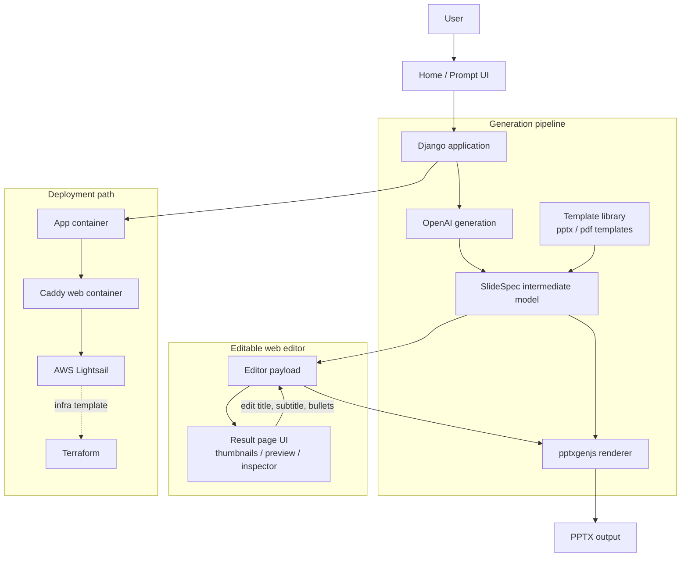

# 블로그 글 기반 아키텍처 시각화 2선

대상 글:

1. `_posts/2025-11-07-firstblogpost.md`
2. `_posts/2026-03-30-pptauto3.md`

선정 이유:

- 첫 글: CI/CD 파이프라인이 단순하고 전달력 좋음
- 둘째 글: 생성, 편집, 렌더, 배포 경계가 분명해서 포트폴리오용 그림으로 좋음

---

## 1) Jekyll 블로그 자동배포 아키텍처

원문 기준 핵심:

- 로컬/깃허브에서 글 작성
- `main` push
- GitHub Actions 실행
- SSH로 EC2 접속
- 서버에서 Jekyll build
- `_site`를 Nginx 문서 루트로 반영
- 최종 도메인 서빙

```mermaid
flowchart LR
    A["Writer / Local authoring"] -->|git push main| B["GitHub Repository"]
    B --> C["GitHub Actions<br/>deploy workflow"]
    C -->|setup SSH + known_hosts| D["EC2 Ubuntu 24.04"]

    subgraph EC2["EC2 build and deploy host"]
      D --> E["/home/ubuntu/myblog<br/>working tree"]
      E --> F["rbenv Ruby 3.3.4"]
      F --> G["bundle install"]
      G --> H["bundle exec jekyll build"]
      H --> I["_site output"]
      I --> J["rsync to /var/www/myblog"]
      J --> K["Nginx"]
    end

    K --> L["https://blog.juwonpark.me"]
```

### 읽는 포인트

- CI가 단순 빌드만 하는 게 아니라 원격 서버까지 제어
- 서버 안에서 `git fetch/reset`, `bundle install`, `jekyll build`, `rsync`가 직렬 실행
- 최종 서빙 책임은 GitHub가 아니라 EC2 + Nginx

---

## 2) AI 발표자료 생성 웹앱 아키텍처

원문 기준 핵심:

- 사용자가 주제와 템플릿 선택
- Django 앱이 생성 흐름 오케스트레이션
- OpenAI 결과를 바로 PPT로 쓰지 않고 `SlideSpec` 중간 구조로 정리
- 웹 편집기에서 수정
- `pptxgenjs`로 최종 렌더
- Docker + Caddy + Lightsail 경로로 배포 준비

### 읽는 포인트

- 핵심 분리축은 `생성 -> 구조화 -> 편집 -> 렌더 -> 배포`
- `SlideSpec`이 OpenAI 출력과 최종 PPTX 사이의 완충층 역할
- 편집기는 결과 확인 화면이 아니라 재렌더 가능한 제품 레이어
- Docker / Caddy / Lightsail은 앱 런타임 경로, Terraform은 반복 가능한 인프라 템플릿 경로

---

## 덤: 포트폴리오용으로 더 강한 쪽

- 전달력 1등: `Jekyll 블로그 자동배포`
- 시스템 설계 어필 1등: `AI 발표자료 생성 웹앱`

둘 다 업워크/포트폴리오 문서에 넣으려면:

- Jekyll 다이어그램: "CI/CD and delivery pipeline"
- AI PPT 다이어그램: "AI generation and editable rendering workflow"
